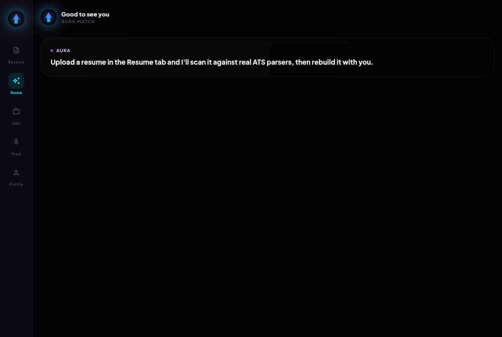
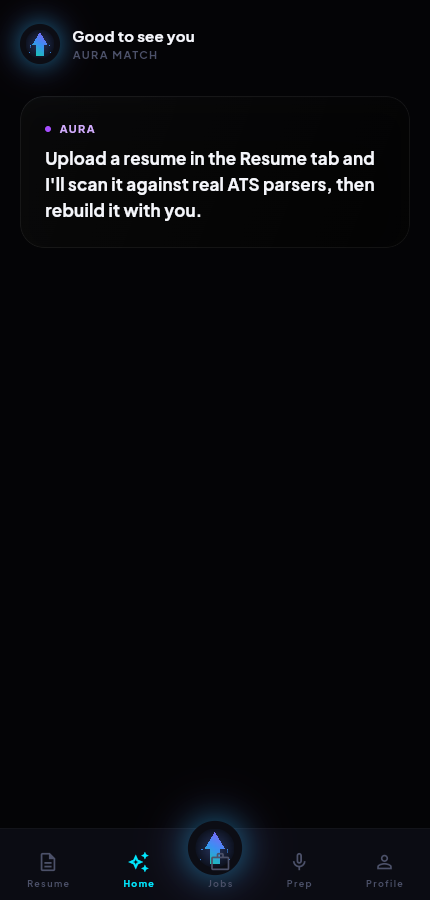
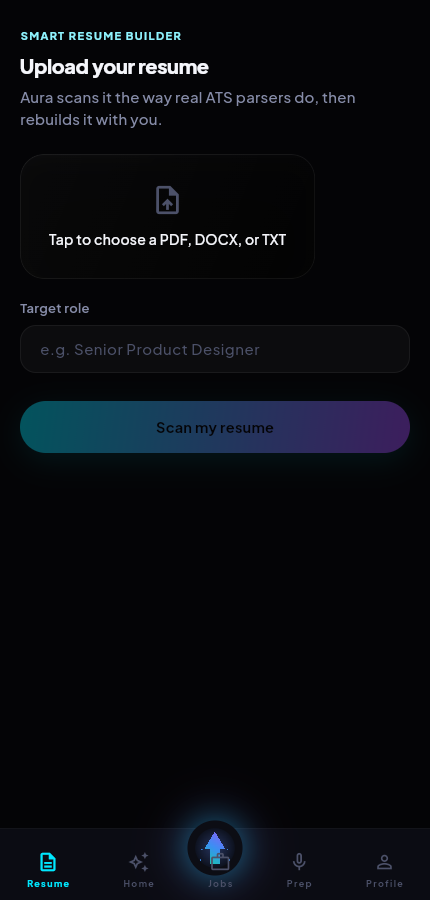

<div align="center">


# AURA MATCH

**The AI that finds your next job while you sleep.**

One AI — Aura — rewrites your resume so it survives the machines, scores it the way a real hiring manager would, applies to the roles worth your time, and rehearses you for the call.

Flutter · iOS · Android · macOS · Web &nbsp;|&nbsp; Node.js backend &nbsp;|&nbsp; Groq (Llama 3.3 / 3.1)

</div>

<br/>

<table>
<tr>
<td width="55%"></td>
<td width="22%"></td>
<td width="23%"></td>
</tr>
</table>

---

## What it does

| Feature | What Aura actually does |
|---|---|
| **Smart Resume Builder** | Upload a resume → Aura scans it the way real ATS parsers do, finds the gaps against your target role, asks a few plain-language questions to fill them, and rebuilds it — never inventing experience you don't have. |
| **AI Hiring Manager Mode** | Aura reviews the rebuilt resume as a hiring manager from a specific industry/region persona would, in a 7-second first skim — scored, not just complimented. |
| **Automatic Job Search & Apply** | Aura searches for roles that fit, and only auto-applies above a consent-gated fit threshold — anything borderline waits for you to say yes. |
| **Interview Practice Simulator** | The moment a real interview is secured, Aura runs a mock session against the actual job description and gives you a performance report before the real one happens. |

Current build covers the Smart Resume Builder and Hiring Manager Mode end-to-end (upload → scan → AI Q&A → rebuild → score). Automatic Apply and the Interview Simulator are specced in [`AGENT_ARCHITECTURE.md`](AGENT_ARCHITECTURE.md) and not yet built — see [Roadmap](#roadmap).

---

## Project structure

```
aura-match/
├── app/                    Flutter app — iOS, Android, macOS, Web
│   ├── lib/
│   │   ├── theme/           Design tokens (color, type, radius, shadow, motion)
│   │   ├── widgets/          Shared components (glass panels, bento tiles, the Aura orb)
│   │   ├── screens/          Resume Builder, Hiring Manager, Home, Shell
│   │   ├── state/            App state (Provider/ChangeNotifier)
│   │   └── services/         API client — the only code that talks to the backend
│   └── ARCHITECTURE.md      Clean Architecture / MVVM plan for the app
│
├── server/                 Node.js backend — the only thing holding API keys
│   └── src/
│       ├── groqClient.js    Groq SDK, model routing, retry/backoff
│       └── routes/          /api/resume/*, /api/hiring-manager/*
│
├── render.yaml              Render deploy blueprint
└── *.md                      Architecture, database, business, and admin planning docs
```

---

## Getting started

**Prerequisites:** [Flutter SDK](https://flutter.dev), [Node.js 20+](https://nodejs.org), and a free [Groq API key](https://console.groq.com/keys).

### 1. Backend

```bash
cd server
npm install
cp .env.example .env      # then add your real GROQ_API_KEY
npm start                 # → http://localhost:8787
```

Confirm it's alive: `curl http://localhost:8787/api/health` should return `{"ok":true,"aiConfigured":true}`.

### 2. App

```bash
cd app
flutter pub get
flutter run -d chrome      # or -d macos, -d windows, an emulator, a real device
```

The app talks to `http://localhost:8787` by default (`http://10.0.2.2:8787` automatically on Android emulators) — see `lib/services/api_client.dart` if you need to point it somewhere else.

### Environment variables

All of these live in `server/.env` (git-ignored — never commit this file):

| Variable | Required | Description |
|---|---|---|
| `GROQ_API_KEY` | Yes | Free key from [console.groq.com](https://console.groq.com/keys) |
| `GROQ_DEEP_MODEL` | No | Defaults to `llama-3.3-70b-versatile` — used for resume/hiring-manager analysis |
| `GROQ_FAST_MODEL` | No | Defaults to `llama-3.1-8b-instant` — reserved for interactive chat/interview turns |
| `PORT` | No | Defaults to `8787` |

---

## Deployment

The backend deploys to Render's free tier via [`render.yaml`](render.yaml). Two paths, depending on whether you connect a GitHub account:

- **Connected:** Render Dashboard → New → Blueprint → select this repo → it reads `render.yaml` automatically.
- **Not connected:** New → Web Service → "Public Git Repository" → paste this repo's URL → fill in the same settings from `render.yaml` by hand (root dir `server`, build `npm install`, start `npm start`, health check `/api/health`).

Either way, `GROQ_API_KEY` is entered directly in the Render dashboard — it is never read from the YAML file. Render's free tier sleeps after 15 minutes idle; [`.github/workflows/keep-alive.yml`](.github/workflows/keep-alive.yml) pings the health endpoint every 10 minutes to prevent that (fill in the real URL after your first deploy).

---

## Documentation

This project is planned in more depth than it's built — each phase has a full spec before it's implemented:

| Document | Covers |
|---|---|
| [`app/ARCHITECTURE.md`](app/ARCHITECTURE.md) | Flutter Clean Architecture + MVVM — folder structure, entities, ViewModels |
| [`AGENT_ARCHITECTURE.md`](AGENT_ARCHITECTURE.md) | The multi-agent AI backend plan (LangGraph) for Auto-Apply and the Interview Simulator |
| [`DATABASE_ARCHITECTURE.md`](DATABASE_ARCHITECTURE.md) | Supabase schema, RLS policies, vector search for job matching |
| [`BUSINESS_PLAN.md`](BUSINESS_PLAN.md) | Pricing, unit economics, launch marketing plan |
| [`ADMIN_DASHBOARD.md`](ADMIN_DASHBOARD.md) | Internal ops dashboard — revenue, AI cost guardrails, privacy compliance |
| [`FREE_LLM_MIGRATION.md`](FREE_LLM_MIGRATION.md) | Multi-provider free-LLM fallback strategy (Groq → Google → OpenRouter → Ollama) |

---

## Roadmap

- [x] **Phase 0/1** — Design system, Smart Resume Builder, AI Hiring Manager Mode
- [ ] **Phase 2** — Automatic Job Search & Apply, with a consent gate before anything is submitted
- [ ] **Phase 3** — Interview Practice Simulator (text mode, then voice)
- [ ] **Phase 4** — Native platform polish, accessibility audit, motion QA

---

## License

No license file is currently included — under default copyright, that means all rights are reserved and this code isn't licensed for reuse by others, even though the repository is public. Add a `LICENSE` file if you want to grant different terms.

<div align="center">
<sub>Built with Claude Code.</sub>
</div>
